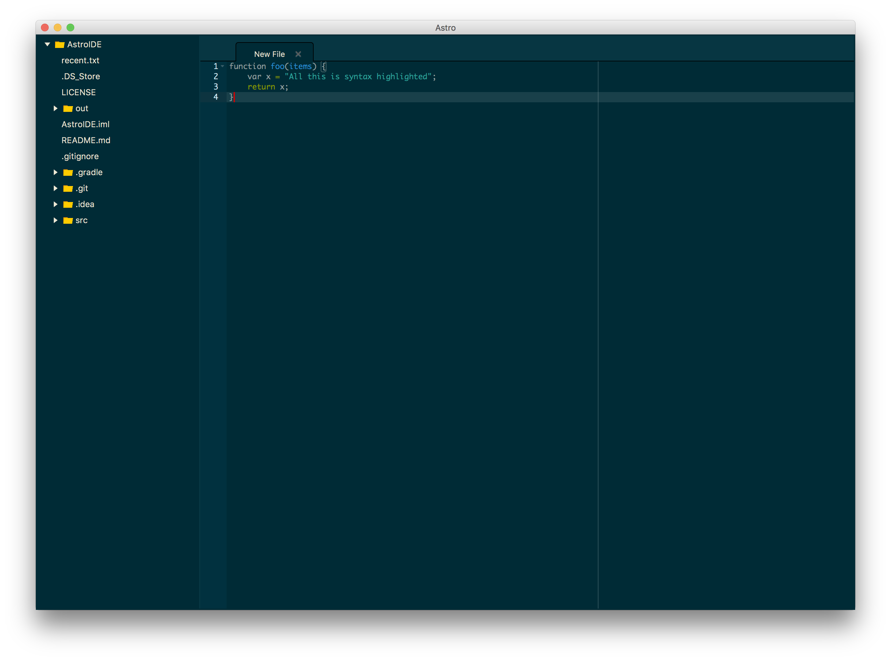
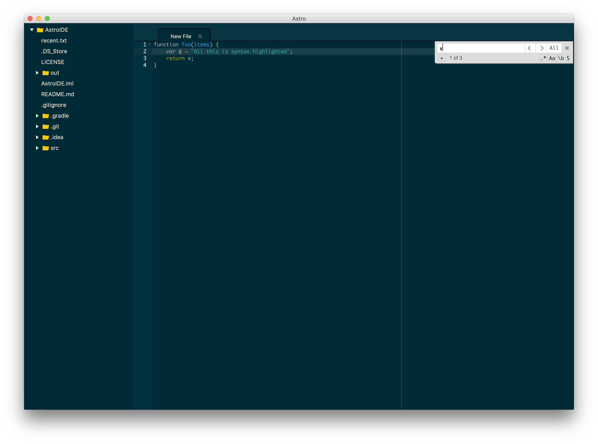

# main.java.me.joshmcfarlin.AstroIDE

A multi-platform main.java.me.joshmcfarlin.AstroIDE with syntax highlighting support for over **110 languages**. Written in Java utilizing JavaFX and Ace.js for syntax highlighting.

## Status

While the base of the application has been created, a few unfinished things are:
* Opening files (Text component was changed to JS through a webview and issues with sending strings)
* Settings menu

## Images

## Language Support

* ABAP
* ABC
* ActionScript
* ADA
* Apache_Conf
* AsciiDoc
* Assembly_x86
* AutoHotKey
* BatchFile
* C9Search
* C_Cpp
* Cirru
* Clojure
* Cobol
* coffee
* ColdFusion
* CSharp
* CSS
* Curly
* D
* Dart
* Diff
* Dockerfile
* Dot
* Dummy
* DummySyntax
* Eiffel
* EJS
* Elixir
* Elm
* Erlang
* Forth
* FTL
* Gcode
* Gherkin
* Gitignore
* Glsl
* golang
* Groovy
* HAML
* Handlebars
* Haskell
* haXe
* HTML
* HTML_Ruby
* INI
* Io
* Jack
* Jade
* Java
* JavaScript
* JSON
* JSONiq
* JSP
* JSX
* Julia
* LaTeX
* LESS
* Liquid
* Lisp
* LiveScript
* LogiQL
* LSL
* Lua
* LuaPage
* Lucene
* Makefile
* Markdown
* Mask
* MATLAB
* MEL
* MUSHCode
* MySQL
* Nix
* ObjectiveC
* OCaml
* Pascal
* Perl
* pgSQL
* PHP
* Powershell
* Praat
* Prolog
* Properties
* Protobuf
* Python
* R
* RDoc
* RHTML
* Ruby
* Rust
* SASS
* SCAD
* Scala
* Scheme
* SCSS
* SH
* SJS
* Smarty
* snippets
* Soy_Template
* Space
* SQL
* Stylus
* SVG
* Tcl
* Tex
* Text
* Textile
* Toml
* Twig
* Typescript
* Vala
* VBScript
* Velocity
* Verilog
* VHDL
* XML
* XQuery
* YAML

## Themes

* ambiance
* chaos
* chrome
* clouds
* clouds_midnight
* cobalt
* crimson_editor
* dawn
* dracula
* dreamweaver
* eclipse
* github
* gob
* gruvbox
* idle_fingers
* iplastic
* katzenmilch
* kr_theme
* kuroir
* merbivore
* merbivore_soft
* mono_industrial
* monokai
* pastel_on_dark
* solarized_dark
* solarized_light
* sqlserver
* terminal
* textmate
* tomorrow
* tomorrow_night
* tomorrow_night_blue
* tomorrow_night_bright
* tomorrow_night_eighties
* twilight
* vibrant_ink
* xcode

## License

This project is developed under the Apache License. This license can be found at [LICENSE](LICENSE).

